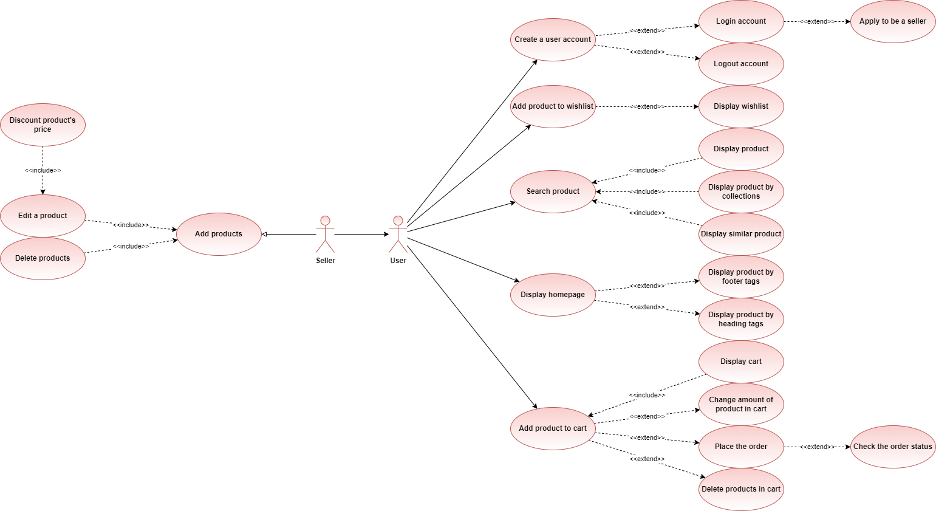
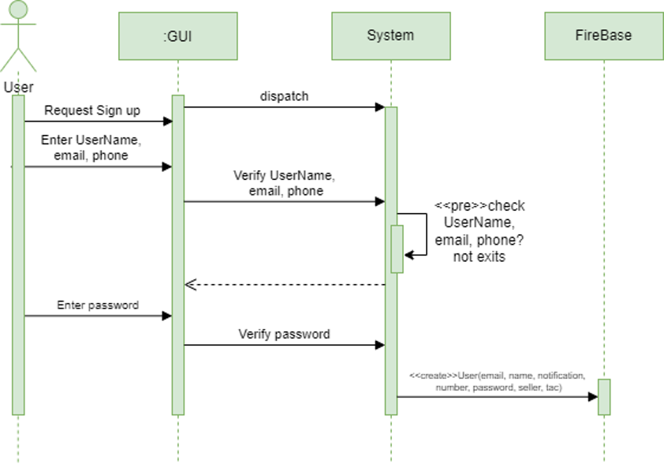
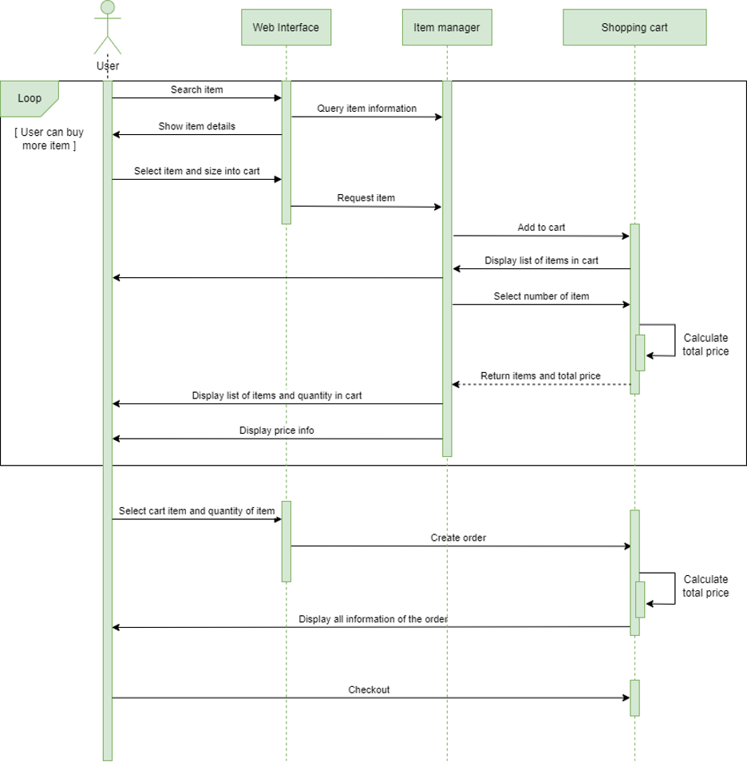
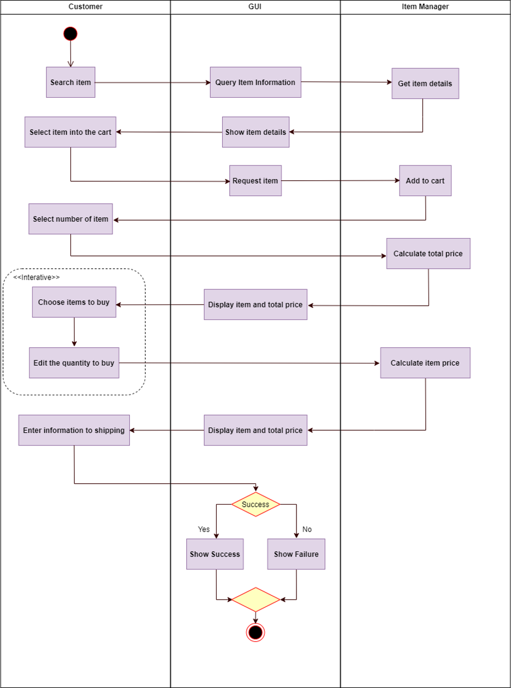

# e-commerce-website
<h2>this is my team</h2>
<table border = 1>
<tr>
<th>Name</th>
<th>StudentID</th>
</tr>
<tr>
<td>Tran Doan Quoc Dat</td>
<td>ITITWE19020</td>
</tr>
<tr>
<td>Mai Le Hung</td>
<td>ITITIU19125</td>
</tr>
<tr>
<td>Le Do Huy Du</td>
<td>ITITIU18027</td>
</tr>
</table>

<h1>Chapter I: INTRODUCTION</h1>
<h2>I.1. Motivation</h2>

Currently, the quantity and quality of goods serving people's needs is increasing day by day. Along with that is the growth of customer demand. We have also found that having a website for business generates more revenue than with a traditional business model. Simply, we can see that a website brings great benefits in terms of profits through advertising, reaching customers from anywhere. Customers can choose products more proactively. Thereby, we can also interact with customers, record their reviews of the product to improve. Because of the above ideas, we are planned to implement the website called: “HDH Sneaker store”.

<h2>I.2. Problem Statement</h2>

Since a long time, the footwear industry has flourished in Western countries, until recent years, this fashion industry has been imported to Vietnam and widely developed to young people in the region. Moreover, sellers also appear more and more distributors in Vietnam. In which, the two most famous sports shoes lines in this industry belong to Adidas and Nike, which are also two companies that receive huge profits from Vietnamese customers.
The implementation of a sales website also brings a lot of difficulties partly because of the competition among dozens of other selling websites, partly because of the problem of ensuring the quality of a website.
It was possible for the team to develop this website because we saw the potential in sportswear. At the same time, it is a solution for students to have an additional source of income by the seller feature, which also increases the income source for the development team.

<h2>I.3. Scope</h2>

With this project we use a lot of technology to manage time, plan, store data, build interfaces, design interfaces, deploy websites as well as a platform used to create, distribute, and execute website. So, users will have a more realistic experience with the test version than just looking through the demo of the development team.

Not only applying specialized knowledge learned in this project but there is also self-study knowledge to improve the project. Currently, this project only implements all protocols and activities on the website, not on the phone application. There are two types of accounts. First, the manager's account will be provided for the store staff by the information technology management department. Other senior departments supervise all activities of these staff account to avoid errors in the working process. Second, the customer's account will be allowed to create after completing the procedures at the private information and receiving a confirmation message of account activation.

Customers can use the account to order and pay, view the new product in the account, the daily promotion limit, and choose your size of item thourgh sellecting product. Customers can know which products are of interest to customers at that time, can search for products by classified categories. or members who have registered for a seller account, they can simultaneously be a sales associate and add products to the store to make the store richer. In fact, the products stored on the database will be controlled by the admin.

<h1>Chapter II: LITERATURE REVIEW</h1>
<h2>II.1. Similar Applications/Systems</h2>

Nike, originally known as Blue Ribbon Sports (BRS), was founded on January 25, 1964, by University of Oregon alumnus Phil Knight and his coach, Bill Bowerman. The company started out in the Eugene, Oregon area as a distributor of the Japanese Onitsuka Tiger shoe, most of its sales at the time coming from selling car shoes. Knight's bowl.

Later, Nike partnered with Wieden+Kennedy and the two created various print and television commercials. Wieden+Kennedy continues to be the main advertising agency for Nike. And from there, nike's website was born.

<h2>II.2. Platform and Tools Review</h2>

Platform: A Web (web application) is an application program that is hosted on a remote server and distributed over the Internet through a browser interface

Tools: IDE tool: VSCode - A tool to make development more efficient with many extensions to use.

API Testing: Postman - Tool to help with API testing during web application building.

<h1>Chapter III: SYSTEM DESIGN</h1>
<h2>III.1. System Requirement Specification</h2>

Deploying the system will provide fashion items aimed at young people aged 16-30 with a nationwide scope. There will be many users participating in the system as sellers. The system will manage the quantity and selling price of each item

After being stored at the shop, each product will have a unique id, name, size, promotional image, and category to validate it belongs to which type of product, short description, and keywords to be able to search for products online on the system. Each product will be manufactured by a seller, the information about each seller includes about name, email, address, and phone number.

Users/Customers shopping online on the application of the store will have the following information: name, phone number, email, and password (to log in to the store). Customer can purchase one or more item in different quantities. Meanwhile, a customer can buy many products, but a product only is purchased by one customer.

Each product selected by the user will be added to a personal shopping cart. A shopping cart can contain one or more products. Customers will choose to pay for the items in the shopping cart with with as many quantities as they client wants. And once the client clicks the order button, a corresponding invoice will be generated for that purchase which is based on the quantity, price of the item and discount (if any) on the purchased items.

For the main system requirement(recall): A customer can register to purchase an item. After registration, each Customer will have a unique username and password. Customers can purchase one or more items in different quantities. Based on the quantity, price of the item, and discount (if any) on the purchased items, the bill will be generated

<h3>III.1.1. Functional Requirements</h3>
<table border="1">
<tr><th>ID</th><th>Fuctional Requirements</th></tr>
<tr><td>R.1</td><td>Customer able to see and select Product Attributes</td></tr>
<tr><td>R.2</td><td>System has order and checkout flow</td></tr>
<tr><td>R.3</td><td>User can aplly to become seller</td></tr>
<tr><td>R.4</td><td>User can go to facebook page or instagram of store by symbol in homepage</td></tr>
<tr><td>R.5</td><td>System minimum the steps to make an order</td></tr>
<tr><td>R.6</td><td>Seller easy to add or edit their products</td></tr>
<tr><td>R.7</td><td>Interface supporting search or display HOT products</td></tr>
</table>
<h3>III.1.2. Requirements Analysis</h3>

E-Commerce is a platform that has changed the way we shop forever.

Almost all our everyday needs are now supplied by such platforms, ranging from clothing to groceries. In today's world, such an application is critical in many enterprises.

The basic business need for each e-commerce project is the same – a user visits the site and purchases things. A business analyst's challenge is to see all the processes in between. An e-commerce application has a vast scope. The criteria at the micro-level can differ based on the type of products being offered. A business analyst can create a macro-level description of the following needs – business and functional – that apply to most e-commerce systems. The following items can be included on a checklist:

1.	User Actions on The Website

a.	Searching for products on the home page or throughout the website and on what basic. Products can be searched on the basis of product name, categories, brands etc.

b.	Sorting products based on the filters provided. Which filters need to be placed? For clothes, these can be colors, sizes, and types. For groceries.

c.	Adding products to a wish list. If these products can indefinitely remain on the wish list till their respective stocks last or can remain for a definite period.

d.	Making use of available promotional offers and discounts and the business logic behind them.

e.	Creating an account. An account is mandatory for making a purchase.

2.	Admin Console

a.	Product Management – All the metadata of the products – Product images, description, seller information, prices etc. Admin should be able to manage this data i.e., add, remove, and edit a product.

b.	Content management – The design aspect of the website i.e., the static pages a user sees at the front end. It’s important to create an attractive and effective website to attract and retain traffic. The answers that a business analyst should seek here are – How will these pages be maintained? Will these pages be uploaded, or a provision must be made for the admin user such that pages are created through the system?

3.	Inventory And Logistics Management and Order Fulfilment

Sellers can control the number of items for sale and can even add to the existing stock.

4.	User Checkout

Generally, users can check out as registered users or as seller. An option of creating a new account is also available. Some businesses require customers to make an account to place orders. The information required to create an account needs to be considered.

5.	Links to orther interface

Users able to mail or come to other fanpage of store to contact

<h2>III.2. System Design Specification</h2>
<h3>III.2.1. Use-cases Diagram</h3>

Usecase-diagram

<h3>III.2.2. Sequence Diagram</h3>

Sequence Diagram for signing up

Seuqence Diagram for buying products

<h3>III.2.3. Activity Diagram</h3>

Activity diagram of buying products

<h1>V.Future Work</h1>

	In the future, we plan to develop more both in terms of performance and in terms of products. The team plans to add product reviews, a live chat feature between shoppers and admins. In addition, there is a credit card payment system. At the same time we will improve the response time and smoothness of the website and maybe we’ll add and information scrollbar.

